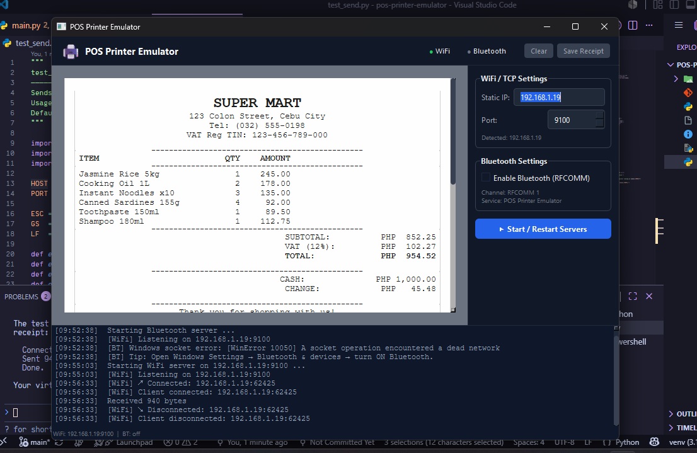

# POS Printer Emulator



A simple Python desktop application built with PyQt6 that emulates a standard thermal receipt printer. It allows developers to test Point of Sale (POS) printing functionality without needing a physical hardware printer.

The application starts a server that listens for incoming connection requests (via TCP/IP or Bluetooth RFCOMM), parses the ESC/POS printer command streams, and renders them on-screen as a virtual receipt.

---

## Features

- **Multi-Protocol Emulation**: Emulates thermal printers over:
  - **WiFi / Network (TCP)** (typically port `9100`)
  - **Bluetooth (RFCOMM)**
- **ESC/POS Command Support**: Parses standard printer instructions including:
  - Text alignments (left, center, right)
  - Text formatting (bold, underline, double-width, double-height)
  - Paper cut command
  - Line feeds and spacing
- **Real-time Receipt Visualizer**: Renders the formatted text in a scrollable, responsive UI.

---

## Installation & Setup

1. **Clone the repository**:
   ```bash
   git clone https://github.com/yourusername/pos-printer-emulator.git
   cd pos-printer-emulator
   ```

2. **Create and activate a virtual environment (optional but recommended)**:
   - **Windows**:
     ```bash
     python -m venv venv
     venv\Scripts\activate
     ```
   - **macOS/Linux**:
     ```bash
     python3 -m venv venv
     source venv/bin/activate
     ```

3. **Install the dependencies**:
   ```bash
   pip install -r requirements.txt
   ```

---

## Running the Emulator

Start the emulator by running:
```bash
python main.py
```

Once running, the UI will display the available network IP addresses and ports to which you can connect your POS software.

### Sending a Test Receipt
You can test the emulator using the provided script:
```bash
python test_send.py [host] [port]
```
*(By default, it will connect to `127.0.0.1` on port `9100` and send a mock receipt).*

---

## Packaging / Building Executable
If you want to package the application into a standalone executable, you can use PyInstaller with the provided spec file:
```bash
pip install pyinstaller
pyinstaller pos_emulator.spec
```
The output executable will be created in the `dist/` directory.

---

## Contributing

This project is **open for contributions**! We welcome improvements, bug fixes, features, and suggestions. 

To contribute:
1. **Fork** this repository.
2. **Create a branch** for your feature or bug fix (`git checkout -b feature/amazing-feature`).
3. **Commit** your changes (`git commit -m 'Add some amazing feature'`).
4. **Push** to the branch (`git push origin feature/amazing-feature`).
5. **Open a Pull Request** describing your changes.

Feel free to check out the codebase and submit issues or pull requests. Happy coding!
